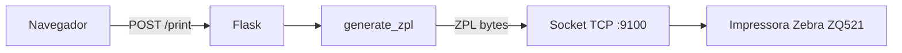

<div align="center">

# Impressão Almox · ZQ521

**Aplicação web local para impressão de etiquetas ZPL em impressoras Zebra ZQ521** (25 × 70 mm) via rede TCP — sem drivers, sem fila de impressão do Windows.


</div>

---

## Sumário

- [Funcionalidades](#funcionalidades)
- [Impressoras configuradas](#impressoras-configuradas)
- [Instalação](#instalação)
- [Como funciona](#como-funciona)
- [Estrutura do projeto](#estrutura-do-projeto)
- [Orientação das impressoras](#orientação-das-impressoras)
- [Tecnologias](#tecnologias)

---

## Funcionalidades

| Recurso | Descrição |
|---|---|
| **Modo Individual** | Preencha Fábrica, Material, Descrição e Unidade (últimos dois opcionais) |
| **Modo Fila** | Cole uma seleção TSV direto do SAP e imprima todos os itens em lote |
| **Seletor de impressora** | Cards visuais com nome e IP de cada equipamento |
| **Stepper de cópias** | Controle rápido de quantidade com botões +/− |
| **4 tamanhos de fonte** | Pequena · Média · Grande · Extra Grande |
| **Preview ao vivo** | Visualização da etiqueta com QR code em tempo real |
| **Cancelamento de fila** | Interrompe a impressão em andamento (`~JA` via TCP) |
| **Tema claro/escuro** | Cor base RAL 5009 (Azure Blue), com toggle persistente |
| **Responsivo** | Funciona em desktop, tablet e celular |

---

## Impressoras configuradas

| Nome | IP |
|---|---|
| BR-JGS-WMO-FAB8-Z750 | `10.1.90.27` |
| BR-JGS-WMO-FAB8-Z769 | `10.1.90.28` |

> Para adicionar ou alterar impressoras, edite o dicionário `PRINTERS` em [app.py](app.py).

---

## Instalação

### Pré-requisitos

- Python 3.10+
- Acesso de rede às impressoras na porta **9100 TCP**

### 1. Instalar dependências

```bash
pip install -r requirements.txt
```

### 2. Instalar atalho e auto-start (Windows)

Execute **uma única vez** como o usuário que vai operar a estação:

```bat
instalar.bat
```

O script automaticamente:
- Gera o `icon.ico` da aplicação
- Cria o atalho **IMPRESSAO ALMOX** na área de trabalho
- Configura o início automático do servidor no login do Windows

### 3. Acessar

Clique no atalho da área de trabalho ou abra no navegador:

```
http://<nome-do-computador>:5000/
```

---

## Como funciona



O app monta o comando ZPL (texto, QR code e logo) inteiramente em Python e envia direto para a porta **9100** da impressora via socket TCP — sem passar pela fila de impressão do Windows.

---

## Estrutura do projeto

```
zq521-impression/
├── app.py               # Servidor Flask + geração ZPL + rotas
├── launcher.pyw          # Launcher silencioso (sem janela de console)
├── instalar.bat          # Instalador do atalho e auto-start
├── fix_orientation.py    # Grava orientação padrão nas impressoras (usar se resetar)
├── make_ico.py           # Gera icon.ico (stdlib puro)
├── requirements.txt
├── static/
│   ├── favicon.svg
│   └── weg_logo.png      # Logo impressa na etiqueta
└── templates/
    └── index.html
```

---

## Orientação das impressoras

A bobina é carregada fisicamente invertida. O comando `^POI` corrige a rotação em 180° e já está embutido no ZPL gerado pelo app.

Caso uma impressora seja resetada de fábrica e as etiquetas voltem a sair de ponta-cabeça, rode:

```bash
python fix_orientation.py
```

---

## Tecnologias

- [Flask](https://flask.palletsprojects.com/) — servidor web
- [Pillow](https://python-pillow.org/) — conversão da logo para bitmap ZPL
- [Bootstrap 5](https://getbootstrap.com/) + [Bootstrap Icons](https://icons.getbootstrap.com/) — UI
- [qrcodejs](https://github.com/davidshimjs/qrcodejs) — geração de QR code no browser
- **ZPL II** — linguagem de programação Zebra para etiquetas

---

<div align="center">
<sub>Feito para o almoxarifado · WEG</sub>
</div>
